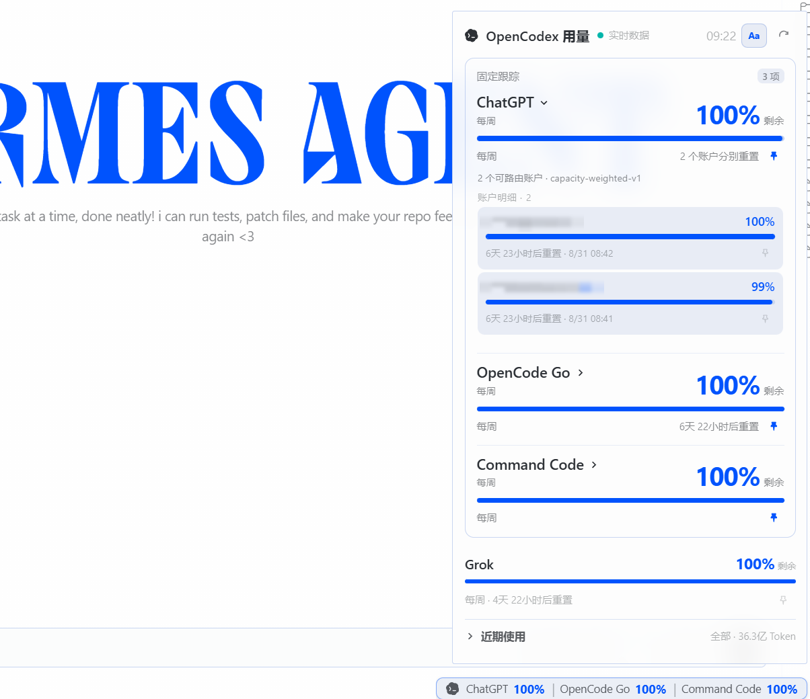

# OpenCodex Usage Meter

<div align="center">

**在 Hermes Desktop 状态栏中查看 OpenCodex 用量与额度。**

支持按 Provider 或子账户固定关注目标，后台持续刷新，并在悬停面板中查看完整明细。

> **English** — A Hermes Desktop status-bar plugin for monitoring OpenCodex quotas across providers and accounts, with live refresh, deterministic pinning, and authenticated read-only usage routes.

[](LICENSE)
[](https://github.com/lidge-jun/opencodex)
[](https://github.com/NousResearch/hermes-agent)



*Inside Hermes Desktop: tracked targets live in a theme-aware status-bar chip (`ChatGPT 6% | OpenCode Go 75%`); hovering opens the panel with one authoritative target per provider.*

</div>

---

## The status bar is the product

Most usage dashboards are somewhere you go. This one is always there:

- **Glanceable chips** — each tracked target renders as `label NN%`, colored by urgency (red ≤10%, yellow ≤25%, blue otherwise), joined with `|`. Labels toggle off when you want just the numbers.
- **Pin what matters** — pin an entire provider or individual accounts from its pool. Provider-level and account-level tracking are mutually exclusive for the same pool, so the latest choice replaces the other representation instead of duplicating it.
- **Hover for depth** — secondary windows (5-hour, monthly), per-account reset times, aggregation notes, and clear context for accounts already promoted to focus cards.

## Usage without the detour

The panel's bottom section answers "what did this cost me?":

- **7-day / 30-day / all tabs** — 7-day data refreshes in the background for the status chip; opening the panel preloads 30-day and all-time views for fast switching.
- Requests, token breakdown (input / output / cached / reasoning), and API-equivalent cost per range, straight from `ocx usage --json`.

## Honest by default

- A live-vs-cached dot and last-success timestamp on every read.
- Manual refresh bypasses the backend cache entirely.
- If upstream history is truncated (see [lidge-jun/opencodex#1497](https://github.com/lidge-jun/opencodex/issues/1497)), the plugin shows the warning rather than a silently wrong total.
- Loading skeleton, empty state, and error state with retry — no blank boxes.

## What changed in 1.1

- **Refined Compactness**: Reduced popover width (326px) and snug card paddings for a lightweight, focused desktop footprint.
- **Natural Bordering**: Removed abrupt single-sided borders in favor of clean, host-native subtle container strokes.
- **Card-based UI**: Redesigned popover layout into clean provider cards aligned with Hermes Desktop native styling.
- **Hidden Scrollbars**: Clean, distraction-free popover panel with hidden scrollbar while preserving natural scroll behavior.
- **Custom Windows & Antigravity Support**: Fully parses and exposes Google Antigravity quotas (`Gemini`, `Claude`, rolling and weekly windows) with clickable pill selectors.
- **Provider Reordering**: Easy up/down card reordering with automatic `localStorage` persistence.
- **Sub-account Pinning**: Direct pinning for individual sub-accounts with distinct gauges, reset times, and status badges.
- **High-performance Snapshots**: Defaults to fast local snapshot reads (`ocx provider quota --json`) for instant 20s background polling without network blocking.
- **Focused Simplicity**: Streamlined interface focusing on actionable quotas without secondary stats clutter.

## What changed in 1.0

- Provider and account tracking are mutually exclusive within one provider pool; the latest choice wins, including migration from pre-1.0 saved state.
- Account pins inside expanded focus cards now work, and promoted accounts are explained instead of silently disappearing from detail counts.
- The 7-day status-chip feed refreshes every 30 seconds even while the popover or Electron window is backgrounded.
- Account refresh failures preserve the last good rows across process restarts, while a successful empty result removes deleted accounts.
- Disk snapshots that may contain masked account labels are written with user-only permissions.

## Install

Requires the [`ocx`](https://github.com/lidge-jun/opencodex) CLI on `PATH` (or `OPENCODEX_EXECUTABLE` pointing at it).

Backend — one command:

```bash
hermes plugins install https://github.com/Vocllum/opencodex-usage-meter --enable
```

Frontend (the installer only handles the backend half):

```bash
mkdir -p ~/.hermes/desktop-plugins/opencodex-usage-meter
curl -fsSL https://raw.githubusercontent.com/Vocllum/opencodex-usage-meter/main/desktop/plugin.js \
  -o ~/.hermes/desktop-plugins/opencodex-usage-meter/plugin.js
```

If you already cloned the repository, copying `desktop/plugin.js` to the same destination is equivalent.

Then `⌘K` → *Reload desktop plugins*. The meter appears in the status bar.

## How it works

```
ocx usage --range <7d|30d|all> --json   ─┐
ocx provider quota --refresh --json     ─┼─▶ FastAPI router ──▶ status-bar React panel
ocx account refresh openai --json       ─┘   (15s cache,
                                             shared quota snapshot)
```

- `dashboard/plugin_api.py` — read-only FastAPI router mounted by Hermes at `/api/plugins/opencodex-usage-meter/`. Normalizes CLI output, caches briefly, shares the slow quota snapshot across ranges. No write endpoints; no credentials read.
- `desktop/plugin.js` — a React status-bar component on the Hermes plugin SDK (`Popover`, `useQuery`). The 7-day query feeds the background-refreshing status chip; 30-day and all-time queries preload when the panel opens.

## Privacy

Everything stays local: the backend shells out to the OpenCodex CLI on your machine and returns aggregated numbers to your own desktop. No credentials are read, exposed, or transmitted.

## Development

```bash
python -m pytest tests/test_plugin_api.py   # backend unit tests
node tests/test_frontend_logic.mjs          # frontend helper assertions
node --check desktop/plugin.js              # syntax gate
```

## License

MIT
